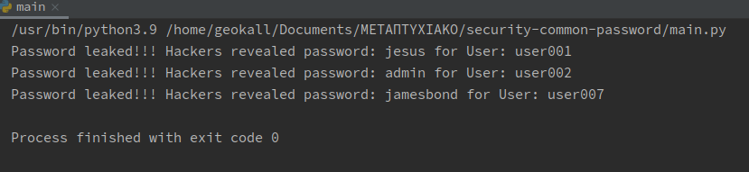

# Leaked Passwords

## Data breach

A data breach is a security violation, in which sensitive, protected or confidential data is copied, transmitted,
viewed, stolen or used by an individual unauthorized to do so. Other terms are unintentional information disclosure,
data leak, information leakage, and data spill. Incidents range from concerted attacks by individuals who hack for
personal gain or malice (black hats), organized crime, political activists or national governments, to poorly configured
system security or careless disposal of used computer equipment or data storage media. Leaked information can range from
matters compromising national security, to information on actions which a government or official considers embarrassing
and wants to conceal. A deliberate data breach by a person privy to the information, typically for political purposes,
is more often described as a "leak".

Data breaches may involve financial information such as credit card and debit card details, bank details, personal
health information (PHI), Personally identifiable information (PII), trade secrets of corporations or intellectual
property. Data breaches may involve overexposed and vulnerable unstructured data – files, documents, and sensitive
information.

Data breaches can be quite costly to organizations with direct costs (remediation, investigation, etc) and indirect
costs (reputational damages, providing cyber security to victims of compromised data, etc.).

## Argon2

Argon2 is a key derivation function that was selected as the winner of the Password Hashing Competition in July 2015. It
was designed by Alex Biryukov, Daniel Dinu, and Dmitry Khovratovich from the University of Luxembourg. The reference
implementation of Argon2 is released under a Creative Commons CC0 license (i.e. public domain) or the Apache License
2.0, and provides three related versions:

Argon2d maximizes resistance to GPU cracking attacks. It accesses the memory array in a password dependent order, which
reduces the possibility of time–memory trade-off (TMTO) attacks, but introduces possible side-channel attacks. Argon2i
is optimized to resist side-channel attacks. It accesses the memory array in a password independent order. Argon2id is a
hybrid version. It follows the Argon2i approach for the first half pass over memory and the Argon2d approach for
subsequent passes. The RFC recommends using Argon2id if you do not know the difference between the types, or you
consider side-channel attacks to be a viable threat.

## How to use Argon2

First install using pip

```python
pip install argon2 - cffi
```

Example from the official documentation:

```python
>> > from argon2 import PasswordHasher
>> > ph = PasswordHasher()
>> > hash = ph.hash("correct horse battery staple")
>> > hash  # doctest: +SKIP
'$argon2id$v=19$m=65536,t=3,p=4$MIIRqgvgQbgj220jfp0MPA$YfwJSVjtjSU0zzV/P3S9nnQ/USre2wvJMjfCIjrTQbg'
>> > ph.verify(hash, "correct horse battery staple")
True
```

## Design - Implementation

There are 3 files:

1) The first file is leaked-passwords.txt which contains 12 leaked passwords.
2) user-plain-text-password.txt with 7 users and their passwords
3) user-hashed-password.txt with these 7 users and their hashed passwords using Argon2

How it works? The very first step is to load the plain text and hashed passwords files and write for the first split,
the username and the second split the hashed passwords. Then compares the hashed password with the leaked passwords(
hashed) and output the result with all leaked passwords as plain text and the user.

Read - Write - Hash

```python
    argon = PasswordHasher()

read_file = open(file_to_read, 'r')
write_file = open(file_to_write, 'w')

for file_line in read_file.readlines():
    split = file_line.replace('\n', '').split(' ')
    write_file.write('{} {}\n'.format(split[0], argon.hash(split[1])))
```

Argon - Verify

```python
    if not pwd_to_hash:
    return False

try:
    if argon.verify(input_hash, pwd_to_hash):
        return True
except argon2.exceptions.VerifyMismatchError:
    return False

return False
```

output

```python
    for user_lines in hashed_passwords.readlines():
    for pwd in common_passwords:
        tokens = user_lines.replace('\n', '').split(' ')

        if argon_verify_by(tokens[1], pwd, argon_ph):
            print('Password leaked!!! Hackers revealed password: {} for User: {}'.format(pwd, tokens[0]))
```

Result:


